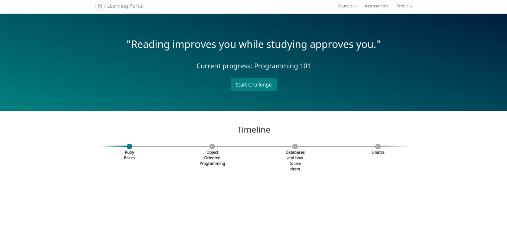
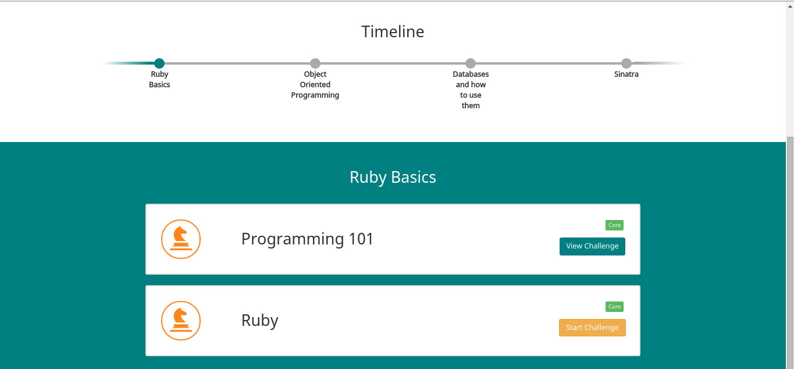
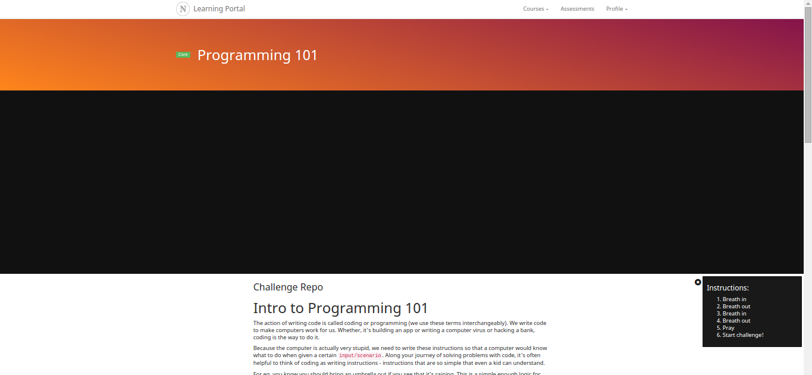

#The Guide to NEXT Academy's learning portal

> Welcome aboard, coders (soon-to-be)! This guide has every information about the learning portal. We hope you will enjoy throughout the course!

Table of Contents
* [Structure of the Syllabus](#structure-of-the-syllabus)
* [First-Time Logging In](#first-time-logging-in-and-setting-up-in-complicated-simple-steps)
* [Dashboard](#dashboard)

## Structure of the Syllabus
-> Course
- The bootcamp you are currently joining: iOS bootcamp, Full Stack Bootcamp etc

---> Topics (Weekly basis)
- While you are in the bootcamp you will be going through every single topics with the mentors <3
- Eg: Ruby, Object-oriented Programming, HTML5/CSS/Javascript, SQL, Sinatra, Rails etc.

-----> Challenges (Daily basis)
- Challenges (or exercises) will be what you be facing every day, because life is always about improving yourself through challenges #YOLO
- Eg: Sudoku solver, RubyRacer, creating Facebook Authentication on your application etc.

## First-Time Logging In and Setting Up in ~~complicated~~ simple steps
- **Log In** with the credentials given to you by NEXT Academy 
- You will then be prompt to do a **one-time update** :

  - Username      -> your desired username 
  - New Password  -> changing your own password
- If you accidentally **skipped the update page**
  - Go Navigation Bar -> Profile -> Edit my account , or
  - **Log out** and **Log In** again
- If you receive _Unable to update your profile_ error
  - Try a different **username**, your username might have been taken.

You will then be redirected to the **Dashboard** after you do your update:

## Dashboard

- Dashboard is the main page where you can have access to your **Topics** and **Challenges**. You will be using it very often.
- **pssh ... pressing the learning portal logo will bring you to the dashboard too ;)**
- **Quotes** are there to motivate you :)
- **Current progress** will show the Challenge you are currently attempting.
- **Timeline**
  -  
  - Each *point* under the timeline is a Topic. *Green points* are points you are currently on/already completed.
    - Clicking the *green point* will show you the list of Challenges for that particular Topic.
    - Clink on *Start Challenge* to start the particular Challenge. Your date and time of starting the challenge will be saved the moment you click it.
    - You must complete the _Core_ challenges (green labels) to be able to proceed to the next Topic.

## Challenges 
- Clicking on *Start/View Challenge* will bring you to Challenge page that contains the following:

  - An introductory **video**
  - **Description** of the Challenge
  - **Task(s)** for you to complete

  - **Feedback**
    - This is to collect feed back from you about the Challenge for us to improve :)
  - **Submit Challenge** (after starting a challenge)
    - Submitting the Challenge will redirect you to the _Code Review_ page.
  - **Comments**
    - Discussions / insights / questions of that Challenge can be made here.
- In order for you to use _Git_ features when doing Challenges, you will need to add SSH key
  - To **Add SSH key**, Go Navigation Bar -> Profile -> Add SSH Key
  - Key in the title and the public key for that Challenge.

## Navigation Bar
- **_Courses_**
  - You can choose your Course here if you are taking multiple Courses
- **_Assessments_**
- **_Profile_**
  - **Log in second user**
    - _Pair programming_ will be introduced during the early stage of the Bootcamp. Two coders will work together as a *pair* on certain Challenges. The other pair will have to log in with this button to start the Challenges as a *pair*
  - **My profile**
    - This will show an overview of your completed challenges and the progress of the Topics.
  - **Add SSH key**
    - You will add your SSH key from here
  - **Edit my account**
    - Edit your settings here: username, firstname , lastname , password (can be left blank)
  - **Log out**
    - Logs out your account. If there are two users logging in, the two users will be logged out.
 
